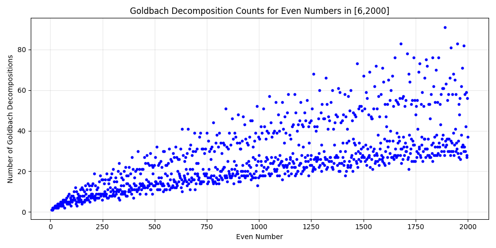

# Goldbach Vibes

Goldbach Vibes is a Python project for exploring the Goldbach Conjecture through code, printing, and plotting. This project is written in Vibe-coded style and provides tools to analyze and visualize Goldbach decompositions.

## About Goldbach Conjecture

The Goldbach Conjecture is one of the oldest unsolved problems in number theory. It states that every even integer greater than 2 can be expressed as the sum of two prime numbers. For example:

- 10: 2 decompositions
  10 = 3 + 7
  10 = 5 + 5
- 10: 2 decompositions
  10 = 3 + 7
  10 = 5 + 5

Goldbach Vibes lets you explore these decompositions programmatically and visually.

## Features

- **Printing**: Print details and counts of Goldbach decompositions for even numbers.
- **Plotting**: Visualize decomposition counts and distances between prime pairs.
- **Vibe-coded**: Written in a clean, modern, and readable Python style.

## Examples


### Plotting Decomposition Counts

```bash
python examples/plot/decomposition_count_plot.py --start 6 --end 2000 --output imgs/decomposition_count_6_2000.png
```

Resulting plot:



## Changelog

### 2025-07-30
- First commit: Added examples for decomposition count and decomposition distance plotting.

---

*Goldbach Vibes* is open for contributions and further exploration!
