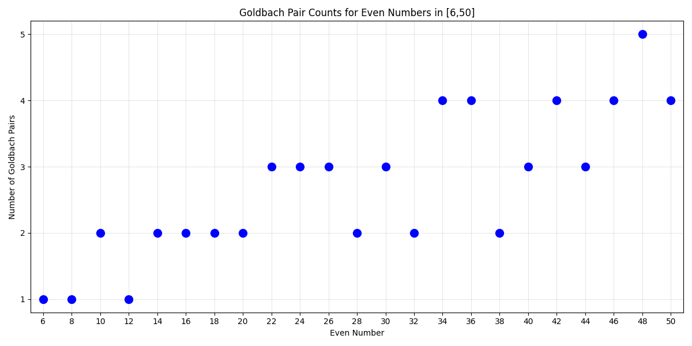
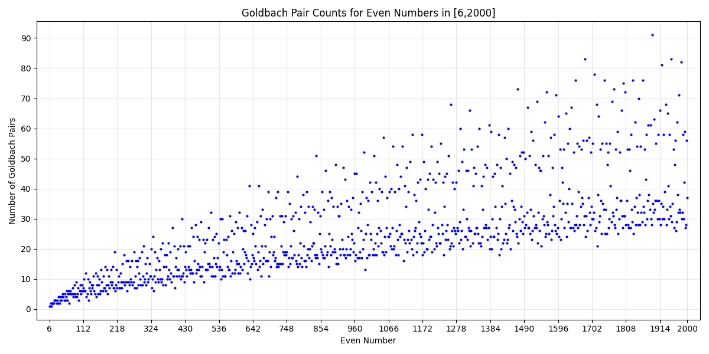
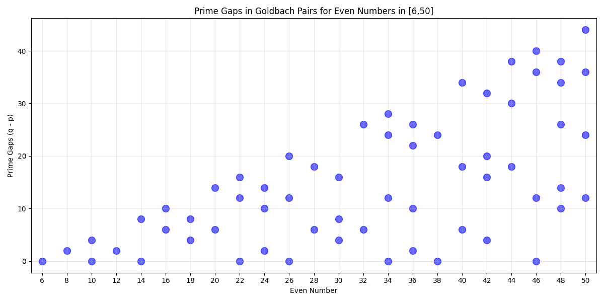
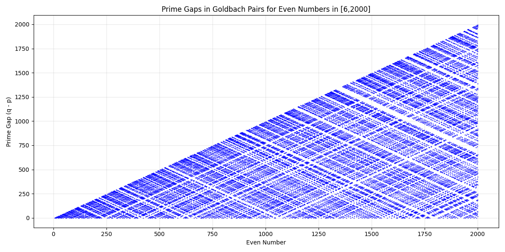
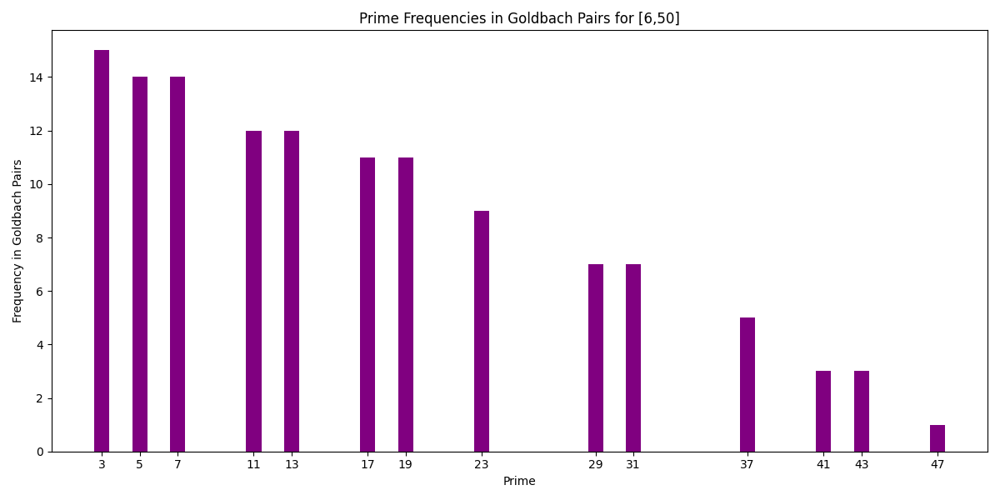
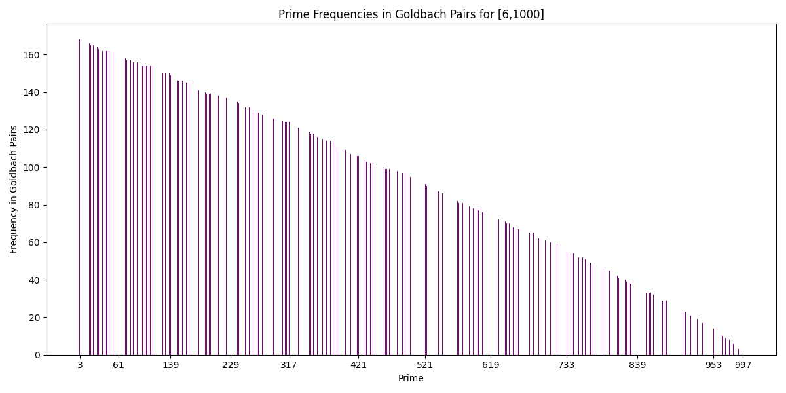
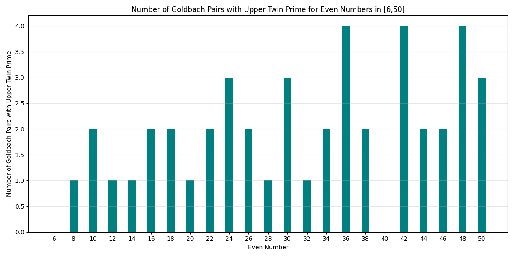
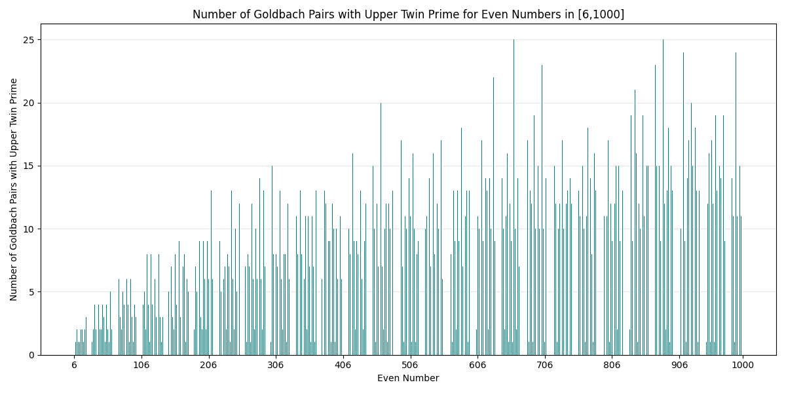
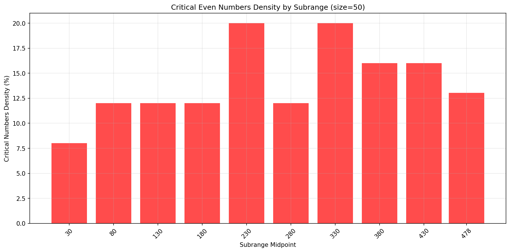
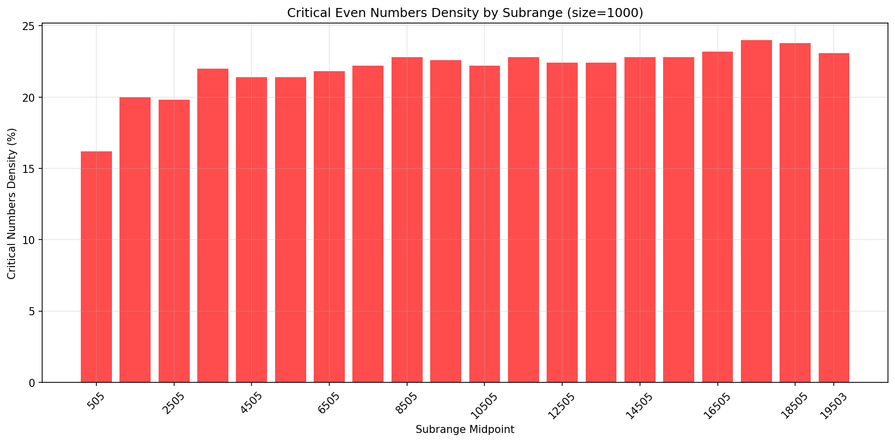

# Goldbach Vibes

Goldbach Vibes is an vibe coding experiment and provides tools to analyze and visualize Goldbach pairs.

## Goldbach Conjecture

The Goldbach Conjecture states that every even integer greater than 2 can be expressed as the sum of two prime numbers. For example:

- 10: 2 Goldbach pairs
  - 10 = 3 + 7
  - 10 = 5 + 5
- 12: 1 Goldbach pair
  - 12 = 5 + 7

## Examples

### Goldbach Pair Counts

```bash
python examples/plot/goldbach_pair_counts_plot.py --start 6 --end 50
```

Plots



#### Goldbach's Comet



### Goldbach Pair Prime Gaps

Goldbach pair prime gaps visualize the difference between the two primes (q - p) in each Goldbach pair (p,q) for even numbers in a given range.

```bash
python examples/plot/goldbach_pair_prime_gaps_plot.py --start 6 --end 50 
```

Plots:




### Prime Frequencies in Goldbach Pairs

Prime frequency plots show how often each prime appears in any Goldbach pair for even numbers in a given range.

```bash
python examples/plot/prime_frequency_numberline_plot.py --start 6 --end 50
```

Plots:




### Goldbach Pairs and Twin Primes

**Twin primes** Pairs of prime numbers that differ by 2, such as (3, 5), (5, 7), (11, 13), etc.

**Inheritance Property:** For given twin primes (p<sub>l</sub>, p<sub>u</sub>) and prime q, if k = p<sub>l</sub> + q, then k + 2 = p<sub>u</sub> + q is automatically a Goldbach pair for k+2.

**Example:** 16 = 11 + 5 implies 18 = 13 + 5 (using twin primes 11, 13).

**Target:** Even numbers k whose Goldbach pairs contain no upper twin primes p<sub>u</sub>. Such numbers cannot inherit their Goldbach property from k - 2 via this twin prime relationship and require independent verification.

```bash
python examples/plot/upper_twin_primes_count_plot.py --start 6 --end 50
```

Plots:




### Critical Even Numbers Density

Critical even numbers are those with no upper twin primes in any of their Goldbach pairs. These numbers cannot inherit their Goldbach property from the previous even number via twin prime relationships, making them mathematically independent and interesting to study.

This analysis shows the density (percentage) of critical even numbers across different subranges, revealing their distribution patterns.

```bash
python examples/plot/critical_density_plot.py --start 6 --end 500 --subrange-size 50
```

Plots:




## Changelog

- 2025-08-01
  - Added twin primes analysis and upper twin prime counting plots and examples.
  - Added critical even numbers density analysis across subranges.

- 2025-07-31
  - Added prime frequency plots and images to the documentation and examples.

- 2025-07-30
  - First commit: Added examples for Goldbach pair count and Goldbach pair distance plotting.

---

*Goldbach Vibes* is open for contributions and further exploration!
