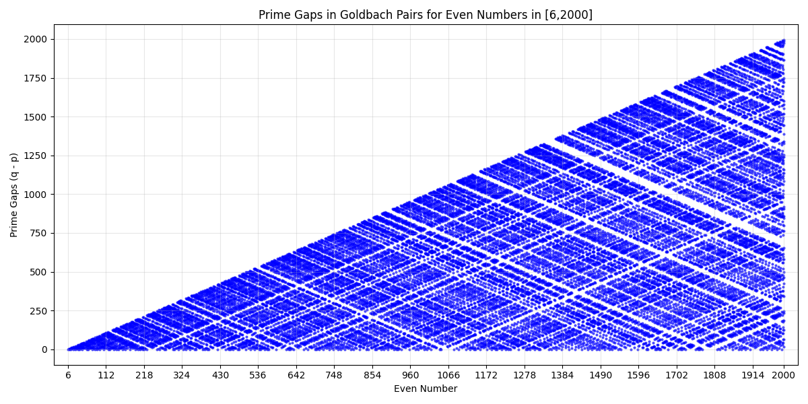

# Goldbach Vibes

Goldbach Vibes is a Python project for exploring the Goldbach Conjecture through code, printing, and plotting. This project is an vibe coding experiment and provides tools to analyze and visualize Goldbach pairs.

## About Goldbach Conjecture

The Goldbach Conjecture states that every even integer greater than 2 can be expressed as the sum of two prime numbers. For example:

- 10: 2 Goldbach pairs
  - 10 = 3 + 7
  - 10 = 5 + 5
- 12: 1 Goldbach pair
  - 12 = 5 + 7

Goldbach Vibes lets you explore these Goldbach pairs programmatically and visually.


## Examples

### Plotting Goldbach Pair Counts (Goldbach's Comet)

```bash
python examples/plot/goldbach_pair_count_plot.py --start 6 --end 2000 
```

Resulting plot:


### Plotting Goldbach Pair Prime Gaps

Goldbach pair prime gaps visualize the difference between the two primes (q - p) in each Goldbach pair (p,q) for even numbers in a given range.

```bash
python examples/plot/goldbach_pair_prime_gaps_plot.py --start 6 --end 2000 
```

Resulting plot:



## Changelog

### 2025-07-30

- First commit: Added examples for Goldbach pair count and Goldbach pair distance plotting.

---

*Goldbach Vibes* is open for contributions and further exploration!
